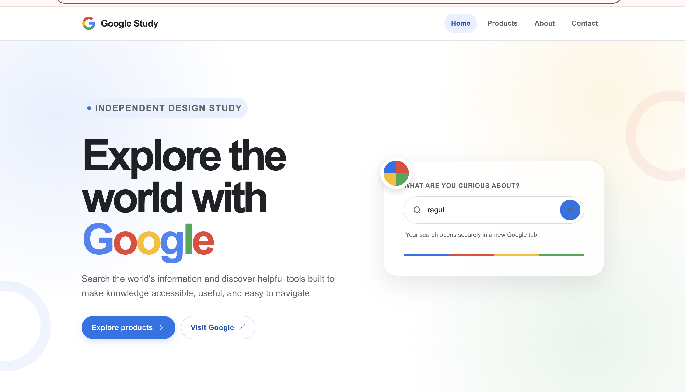

# 🌐 Responsive Web Page

A modern and responsive web page built using HTML, CSS, and JavaScript. This project demonstrates clean UI design, responsive layouts, and interactive web development concepts.

## 🌐 Live Demo

Add your Vercel deployment link here:

https://web-page-jr5s.vercel.app/#home

## 🚀 Features

- Responsive design for all devices
- Modern user interface
- Interactive elements
- Fast and lightweight
- Cross-browser compatibility
- Clean and organized code structure

## 🛠️ Technologies Used

- HTML5
- CSS3
- JavaScript

## 📸 Preview



## 📂 Project Structure

```text
WebPage/
├── index.html
├── style.css
├── script.js
├── screenshots/
│   └── webpage-preview.png
└── README.md
```

## Project Objectives

- Build a responsive webpage using modern web technologies.
- Improve frontend development skills.
- Practice layout design and styling techniques.
- Create a user-friendly web interface.

## Learning Outcomes

Through this project, I learned:

- Responsive Web Design
- CSS Flexbox and Grid
- JavaScript DOM Manipulation
- UI/UX Design Principles
- Frontend Project Structure


## ⭐ Support

If you found this project useful, consider giving it a star on GitHub.
